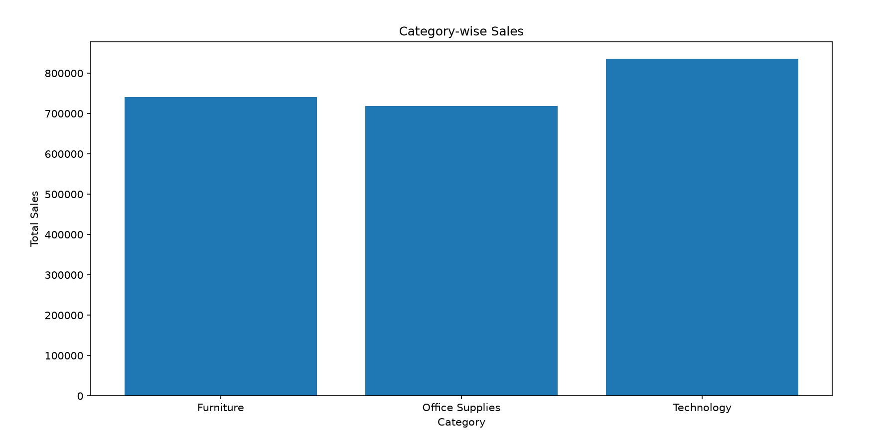
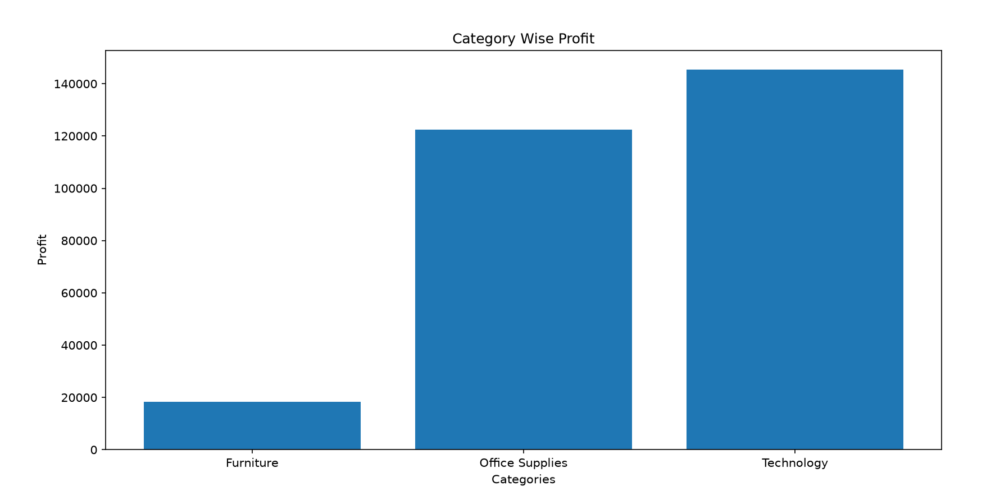
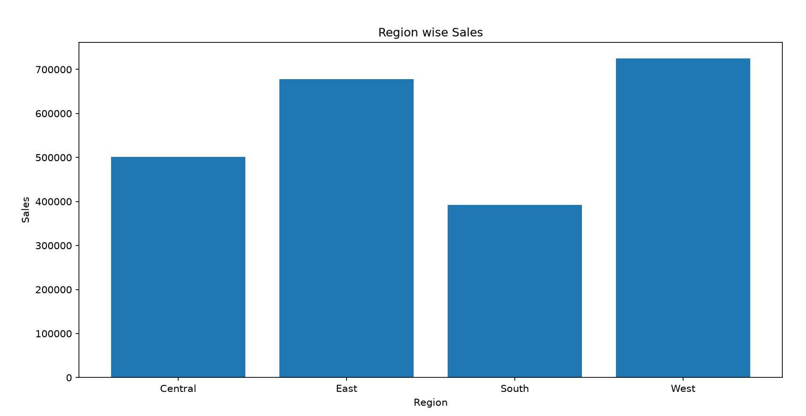
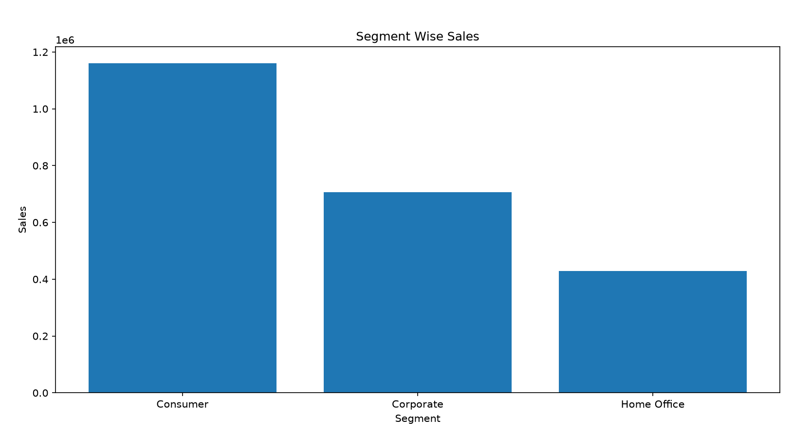
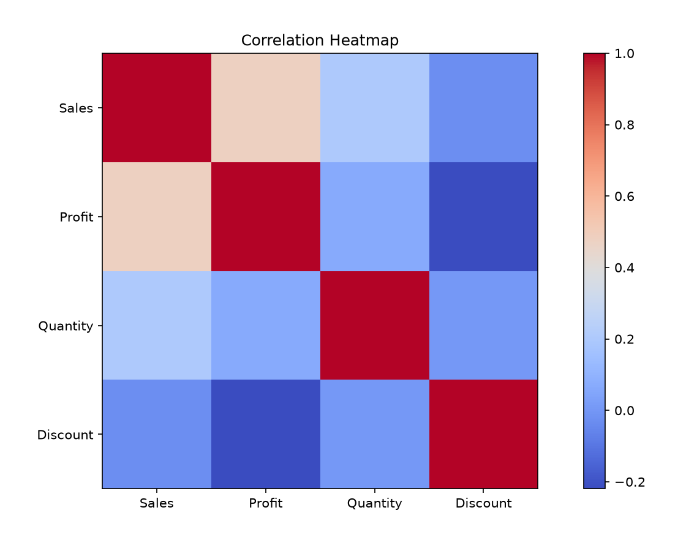

# 📊 Sales Data Analysis Project

> End-to-End Sales Data Analysis using **SQL, Python, Power BI & Excel**

---

## 📌 Project Overview

This project demonstrates a complete Sales Data Analysis workflow starting from raw data to interactive dashboard creation.

The project includes:

- 📂 Data Cleaning
- 🗄 SQL Analysis
- 📈 Exploratory Data Analysis (EDA)
- 📊 Power BI Dashboard
- 💡 Business Insights

---

# 🚀 Tech Stack

| Tool | Purpose |
|-------|----------|
| 📄 Excel | Raw Dataset |
| 🐍 Python | Data Cleaning & Visualization |
| 🗄 MySQL | SQL Analysis |
| 📊 Power BI | Dashboard |
| 🌐 GitHub | Project Documentation |

---

# 📂 Project Structure

```
sales-data-analysis
│
├── Dataset
├── SQL
├── Python
├── PowerBI
├── img
└── README.md
```

---

# 📊 Dashboard Preview


---

# 📈 Python Visualizations

## Category Wise Sales



---

## Category Wise Profit



---

## Region Wise Sales



---

## Segment Wise Sales



---

## Top 10 States


---

## Top 10 Cities


---

## Top 10 Sub Categories


---

## Correlation Heatmap



---

# 📊 Dashboard KPIs

✔ Total Sales

✔ Total Profit

✔ Total Orders

✔ Average Sales

✔ Profit Margin

✔ Average Discount

---

# 📈 SQL Analysis

Performed various SQL operations including:

- SELECT
- WHERE
- ORDER BY
- GROUP BY
- Aggregate Functions
- CASE WHEN
- Subqueries
- Business Queries

---

# 💡 Key Insights

✅ Technology Category generated highest sales.

✅ West Region contributed maximum revenue.

✅ California recorded highest sales.

✅ Phones & Chairs were among the best-selling sub-categories.

✅ Discounts impacted profit margin significantly.

---

# 🎯 Business Recommendations

- Improve inventory planning.

- Reduce high discount dependency.

- Increase marketing in low-performing regions.

- Focus on high-profit categories.

---

# 🚀 Future Improvements

- Connect MySQL directly with Power BI

- Automate ETL Pipeline

- Deploy Dashboard Online

- Build Real-Time Dashboard

---

# 👨‍💻 Author

**Piyush Nirwan**

Aspiring Data Analyst

SQL • Python • Power BI • Excel

---

# ⭐ If you like this project

Please give this repository a ⭐ on GitHub.
